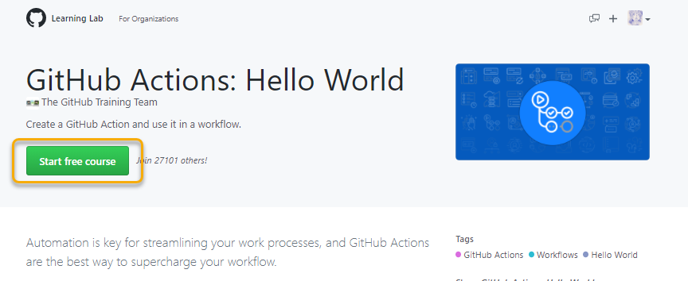
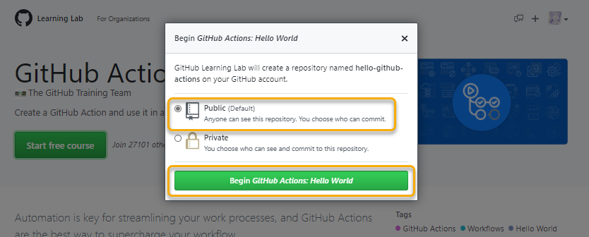
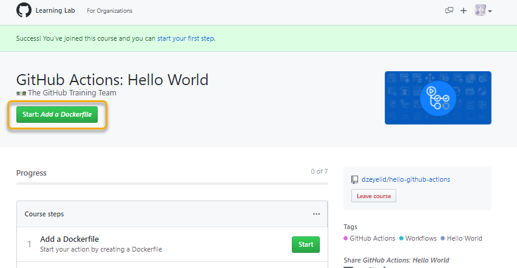
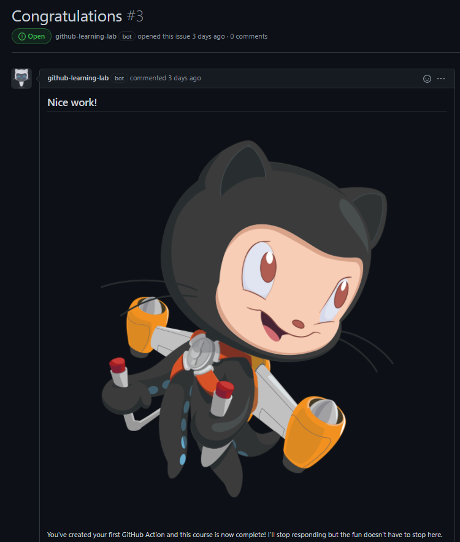
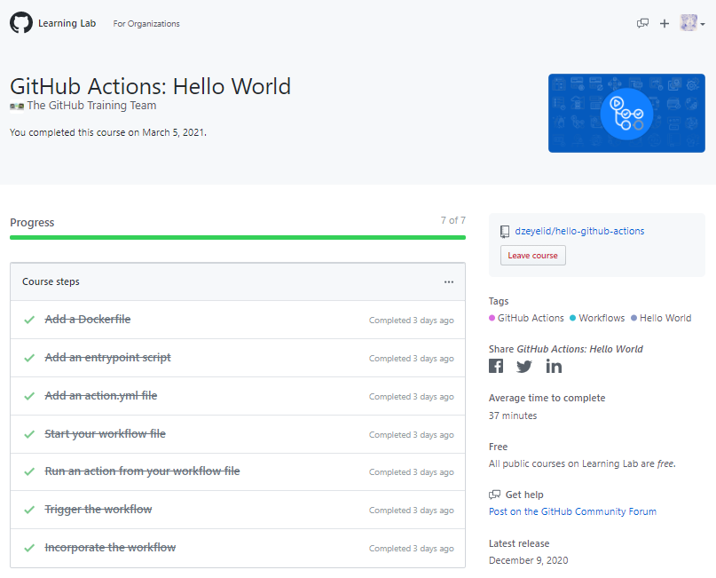

# DevOps workshop - 基礎編

このワークショップでは、GitHub Actions を用いた CI/CD の手法について学びます。

手作業は、人間の細やかな洞察を必要とする場合に向いています。しかし、すべての作業において完璧な洞察と集中力を発揮し、ミスなくこなすことはとても難しいです。中には、定型作業など、人の手を必要とせず自動化できるものもたくさんあり、これがスピード・品質を上げるための有効な施策になります。

ここでは、ソースコードを管理する GitHub 上で連携して利用できる GitHub Actions を用いた自動化について学びましょう。

## ワークショップの流れ

このワークショップでは、 [Microsoft Learn](https://docs.microsoft.com/ja-jp/learn/) や [GitHub Learning Lab](https://lab.github.com/) を用いて学習を進めます。

- [1. はじめての GitHub Actions のワークフローを作成する](#1-はじめての-github-actions-のワークフローを作成する)
- [2. Node.js 製ウェブアプリで、継続的インテグレーション (CI) を行う](#2-nodejs-製ウェブアプリで継続的インテグレーション-ci-を行う)
- [3. Node.js 製ウェブアプリで、継続的デプロイ (CD) を行う](#3-nodejs-製ウェブアプリで継続的デプロイ-cd-を行う)
  - Microsoft Azure の Web App へデプロイする
  - GitHub Packages の Container Registry にデプロイする

### ワークショップに必要な準備

| 項目 | 要否 | 説明 |
|----|----|----|
| GitHub アカウント | 必須 | 実際に GitHub にリポジトリを作って作業するため、 GitHub アカウントをご用意ください。新しく作成する方は [こちら](https://github.com/join) から作成してください。 |
| Microsoft アカウント | (説明参照) | 本ワークショップで利用する Microsoft Learn は、Microsoft アカウントでサインインすると学習記録を記録することができます。サインインせずに利用することもできるので、ご自身の用途によって適宜ご利用ください。新しく作成される方は [こちら](https://account.microsoft.com/account/Account) から作成してください。 |
| Azure アカウント | (説明参照) | Microsoft Azure へのデプロイを体験する場合は、Azure アカウントをご用意ください。新しく作成する方は [こちら](https://azure.microsoft.com/ja-jp/free/) から作成してください。 |

## 1. はじめての GitHub Actions のワークフローを作成する

まず、GitHub Actions とワークフローについて学びます。こちらのモジュールを進めていきましょう。

- Microsoft Learn: [GitHub Actions を使用して開発タスクを自動化する](https://docs.microsoft.com/ja-jp/learn/modules/github-actions-automate-tasks/) (日本語)

このモジュールの演習では、 GitHub Learning Lab を利用します。初めて利用する際は、GitHub へのサインインを求められるので、ご用意したアカウントでサインインして進めてください。

GitHub Learning Lab のコースでは、日本語を選べるものもありますが、ここで利用する [GitHub Actions: Hello World](https://lab.github.com/githubtraining/github-actions:-hello-world) は英語のみのコンテンツです。

コースの学習を始めるには「Start free course」ボタンを選択して進めます。演習用のリポジトリを Public または Private のどちらに作成するか聞かれますので、特段理由がなければ、「Public」を選択し進めてください。

 

 

リポジトリの準備ができたら、「Start: Add a Dockerfile」ボタンを選択し進めましょう。

 

この GitHub Learning Lab では、Docker container を使ってオリジナルのアクションを作ります。実際のところ、ワークフローを組む際は既存のアクションを利用することが多いですが、どうしても必要な処理ができるアクションがない、独自処理を再利用できるようにしたい場合には有効です。

さて、 Congraturations! までたどり着けましたか？

 

GitHub での進捗は、GitHub Learning Lab にも反映されます。なんどでも履修できるので、不安のあるときは見返してみるとよいでしょう。

 

さいごに、Microsoft Learn の画面に戻り、「知識チェック」を試してみましょう。「回答を確認」で全問正解できればクリアです！「続行 >」ボタンを選択し、モジュールを終えましょう🎉

## 2. Node.js 製ウェブアプリで、継続的インテグレーション (CI) を行う

前章では初歩のワークフロー作成を体験しました。この章では、実際の開発を想定して、継続的インテグレーション（CI）ができるワークフローを作成してみましょう。

こちらのモジュールに沿って進みます。

- Microsoft Learn: [GitHub Actions を使用して継続的インテグレーション (CI) ワークフローを作成する](https://docs.microsoft.com/ja-jp/learn/modules/github-actions-ci/)

演習では、 GitHub Learning Lab の [GitHub Actions: Continuous Integration](https://lab.github.com/githubtraining/github-actions:-continuous-integration) を実施します。このコースでは、下記の内容が含まれます。

- テンプレートを使ってワークフローを作成
- アクションログの確認
- アプリケーションのテスト
- ビルド アーティファクトを利用した複数ジョブの利用
- 人によるレビューを介入させる機構
- ブランチ プロテクション

GitHub Learning Lab での演習が終わったら、Microsoft Learn に戻り「知識チェック」を済ませてモジュールを完了しましょう。

## 3. Node.js 製ウェブアプリで、継続的デプロイ (CD) を行う

CI の次は継続的デリバリー（CD）を体験してみましょう。

デプロイしたい先にしたがって、リンク先にお進みください。

  - [Microsoft Azure の Web App へデプロイする](./continuous-deployment/deploy-to-azure-web-app.md)
  - [GitHub Packages の Container Registry に push する](./continuous-deployment/push-container-image-to-github-packages.md)

## Congraturations 🎉

最後までお疲れ様でした！

ここまでたどり着けた方は、 GitHub Actions の基礎をしっかり学ぶことができたことと思います。GitHub Actions のアクションはこちらの [Marketplace](https://github.com/marketplace?type=actions) から探すことができます。快適な開発をお楽しみください！
