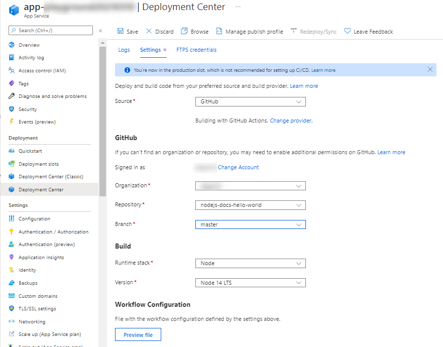
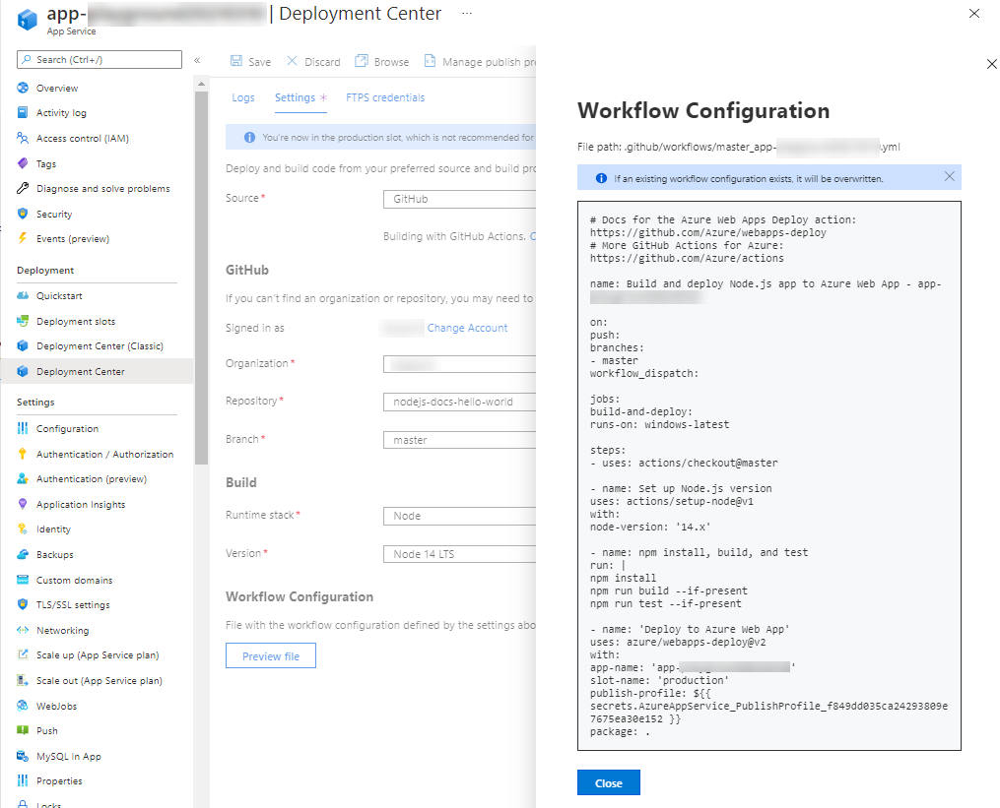
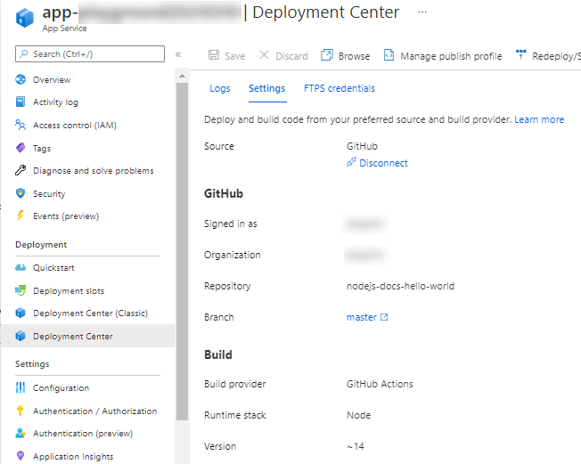

# DevOps workshop - 基礎編

このワークショップでは、GitHub Actions を用いた CI/CD の手法について学びます。

手作業は、人間の細やかな洞察を必要とする場合に向いています。しかし、すべての作業において完璧な洞察と集中力を発揮し、ミスなくこなすことはとても難しいです。中には、定型作業など、人の手を必要とせず自動化できるものもたくさんあり、これがスピード・品質を上げるための有効な施策になります。

ここでは、ソースコードを管理する GitHub 上で連携して利用できる GitHub Actions を用いた自動化について学びましょう。

## ワークショップの流れ

このワークショップでは、 [Microsoft Learn](https://docs.microsoft.com/ja-jp/learn/) や [GitHub Learning Lab](https://lab.github.com/) を用いて学習を進めます。

- 1. [はじめての GitHub Actions のワークフローを作成する](#1-はじめての-github-actions-のワークフローを作成する)
- 2. Node.js 製ウェブアプリで、継続的インテグレーション (CI) を行う
- 3. Node.js 製ウェブアプリで、継続的デプロイ（CD）を行う
  - Microsoft Azure Web App へデプロイする
  - GitHub Packages の Container Registry にデプロイする

### ワークショップに必要な準備

| 項目 | 要否 | 説明 |
|----|----|----|
| GitHub アカウント | 必須 | 実際に GitHub にリポジトリを作って作業するため、 GitHub アカウントをご用意ください。新しく作成する方は [こちら](https://github.com/join) から作成してください。 |
| Microsoft アカウント | (説明参照) | 本ワークショップで利用する Microsoft Learn は、Microsoft アカウントでサインインすると学習記録を記録することができます。サインインせずに利用することもできるので、ご自身の用途によって適宜ご利用ください。新しく作成される方は [こちら](https://account.microsoft.com/account/Account) から作成してください。 |
| Azure アカウント | (説明参照) | Microsoft Azure へのデプロイを体験する場合は、Azure アカウントをご用意ください。新しく作成する方は [こちら](https://azure.microsoft.com/ja-jp/free/) から作成してください。 |

## 1. はじめての GitHub Actions のワークフローを作成する

まず、GitHub Actions とワークフローについて学びます。こちらのモジュールを進めていきましょう。

- Microsoft Learn: [GitHub Actions を使用して開発タスクを自動化する](https://docs.microsoft.com/ja-jp/learn/modules/github-actions-automate-tasks/) (日本語)

このモジュールの演習では、 GitHub Learning Lab を利用します。初めて利用する際は、GitHub へのサインインを求められるので、ご用意したアカウントでサインインして進めてください。

GitHub Learning Lab のコースでは、日本語を選べるものもありますが、ここで利用する [GitHub Actions: Hello World](https://lab.github.com/githubtraining/github-actions:-hello-world) は英語のみのコンテンツです。

コースの学習を始めるには「Start free course」ボタンを選択して進めます。演習用のリポジトリを Public または Private のどちらに作成するか聞かれますので、特段理由がなければ、「Public」を選択し進めてください。

リポジトリの準備ができたら、「Start: Add a Dockerfile」ボタンを選択し進めましょう。

この GitHub Learning Lab では、Docker container を使ってオリジナルのアクションを作ります。実際のところ、ワークフローを組む際は既存のアクションを利用することが多いですが、どうしても必要な処理ができるアクションがない、独自処理を再利用できるようにしたい場合には有効です。

さて、 Congraturations! までたどり着けましたか？ GitHub での進捗は、GitHub Learning Lab にも反映されます。なんどでも履修できるので、不安のあるときは見返してみるとよいでしょう。

さいごに、Microsoft Learn の画面に戻り、「知識チェック」を試してみましょう。「回答を確認」で全問正解できればクリアです！「続行 >」ボタンを選択し、モジュールを終えましょう🎉

## 2. Node.js 製ウェブアプリで、継続的インテグレーション (CI) を行う

前章では初歩のワークフロー作成を体験しました。この章では、実際の開発を想定して、継続的インテグレーション（CI）ができるワークフローを作成してみましょう。

こちらのモジュールに沿って進みます。

- Microsoft Learn: [GitHub Actions を使用して継続的インテグレーション (CI) ワークフローを作成する](https://docs.microsoft.com/ja-jp/learn/modules/github-actions-ci/)

演習では、 GitHub Learning Lab の [GitHub Actions: Continuous Integration](https://lab.github.com/githubtraining/github-actions:-continuous-integration) を実施します。このコースでは、下記の内容が含まれます。

- テンプレートを使ってワークフローを作成
- アクションログの確認
- アプリケーションのテスト
- ビルド アーティファクトを利用した複数ジョブの利用
- 人によるレビューを介入させる機構
- ブランチ プロテクション

GitHub Learning Lab での演習が終わったら、Microsoft Learn に戻り「知識チェック」を済ませてモジュールを完了しましょう。

## 3. Node.js 製ウェブアプリを Azure Web App へデプロイする

CI の次は継続的デリバリー（CD）を体験してみましょう。GitHub Actions を利用しウェブアプリを Azure Web App へデプロイします。

Azure Web App は様々な言語に対応した PaaS サービスです。詳細は下記ドキュメントなどをご参照ください。

- [概要 - Azure App Service | Microsoft Docs](https://docs.microsoft.com/ja-jp/azure/app-service/overview)

ここでは、下記のドキュメントを参考に学習を進めます。

- [Continuous deployment to Azure App Service](https://docs.microsoft.com/en-us/azure/app-service/deploy-continuous-deployment?tabs=github)
  - ※ 日本語の記事の更新が追いついておらず GitHub Actions の記載がないため、英語のドキュメントを参照します。

大まかな流れは下記のとおりです。

1. ウェブアプリのコードを用意する
1. Azure Web App のリソースを作成する
1. Azure ポータルから Deployment Center を設定する

なお、Microsoft Learn にも Azure Web App へデプロイするシナリオのモジュール [GitHub Actions を使ったアプリケーションのビルドと Azure へのデプロイ](https://docs.microsoft.com/ja-jp/learn/modules/github-actions-cd/) があります。こちらは、Docker コンテナのイメージを作成し、Azure Web App for Containers へデプロイする方法を学ぶことができます。ご興味ある方はご参考ください。

それではまず、デプロイに使用するウェブアプリとして、上記ドキュメントの「[Prepare your repository](https://docs.microsoft.com/en-us/azure/app-service/deploy-continuous-deployment?tabs=github#prepare-your-repository)」で言及されている条件を満たすコードを、自身の GitHub のリポジトリに用意します。とくに利用したいコードがない場合は、こちら [Azure-Samples/nodejs-docs-hello-world](https://github.com/Azure-Samples/nodejs-docs-hello-world) をフォークしてください。（クイックスタート: [Azure で Node.js Web アプリを作成する
](https://docs.microsoft.com/ja-jp/azure/app-service/quickstart-nodejs?pivots=platform-windows) で利用されているコードです。）

つぎに、Azure Web App のリソースを作成しましょう。Runtime stack を前述で用意したコードに一致するよう選択し、その他の項目は適宜設定してリソースを作成してください。参考として、下記の設定で作成します。

| 項目 | 説明 |
|----|----|
| Resource Group | 「Create new」を選択し、`rg-` で始まる文字列で作成 |
| Name | `app-` で始まる文字列で作成 |
| Publish | 「Code」を選択 |
| Runtime stack | 「Node.js 14 LTS」を選択 |
| Operationg System | 「Windows」を選択 |
| Region | 最寄りのリージョン（「Japan East」など）を選択 |
| App Service Plan | 「Create new」を選択し、 `plan-` で始まる文字列で作成 |
| Sku and size | 「Free F1」 |
| Monitoring タブ | 今回は設定不要 |
| Tags タブ | 今回は設定不要 |

リソース名は、この推奨される省略形を利用すると、識別しやすくなります。

- [Azure リソースの種類に推奨される省略形 - Cloud Adoption Framework | Microsoft Docs](https://docs.microsoft.com/ja-jp/azure/cloud-adoption-framework/ready/azure-best-practices/resource-abbreviations)

リソースの作成が完了したら、作成直後のウェブアプリの様子を確認しておきましょう。「Go to resource」ボタンから作成したリソースの画面に遷移し、「Overview」で「URL」を参照します。

それでは、早速 Deployment Center から GitHub Actions を設定しましょう！

左のメニューから「Deployment Center」を選択肢画面に遷移します。「Seettings」タブを開き、各項目を設定します。

| 設定項目 | 説明 |
|----|----|
| Source | 「GitHub」を選択 |
| GitHub > Authorize （または Signed in as） | 利用する GitHub アカウントでサインインし接続。サインイン済みでアカウントを変えたい場合は「Change Account」から変更 |
| GitHub > Organization | GitHub アカウントと同名の文字列、または利用したい組織を選択 |
| GitHub > Repository | 利用するリポジトリを選択（前述のクイックスタートのコードを利用される方は「nodejs-docs-hello-world」を選択） |
| GitHub > Branch | 利用するブランチを選択（前述のクイックスタートのコードを利用される方は「master」を選択） |
| Build > Runtime stack | 利用するランタイムスタックを選択（前述のクイックスタートのコードを利用される方は「Node」を選択） |
| Build > Version | 利用する言語のバージョンを選択（前述のクイックスタートのコードを利用される方は「Node 14 LTS」を選択） |

ここまで入力し、「Preview file」を選択すると、生成されるワークフローのコードを確認することができます。

問題なければ、画面上部の「Save」を選択し保存します。

設定した GitHub リポジトリを開き、作成されたワークフローファイルやアクションの実行状況を見てみましょう。

`.github/workflows` ディレクトリに新しくワークフローファイルが作成され、先ほど Azure ポータルの「Preview file」で表示したコードが反映されていることがわかります。

つぎに、アクションの実行状況を見てみると、先ほど作成した Web App にデプロイされていることがわかります。

Web App の URL を開くと、紐づけた GitHub リポジトリのコードが反映されていることがわかります。

### `Azure/webapps-deploy` アクションについて

自動生成されたワークフローファイルでは、 [Azure/webapps-deploy](https://github.com/Azure/webapps-deploy) アクションを利用して Azure Web App にデプロイしています。

Azure Web App にデプロイするには認証が必要で、このアクションでは、２通りのやり方が提供されています。詳しくはドキュメントをご参照ください。

| 認証方法 | 説明 |
|----|----|
| パブリッシュプロファイルを利用する | Azureポータルなどを使用し「デプロイ資格情報」を取得し、`Azure/webapps-deploy` のプロパティ `publish-profile` に指定（指定するときは GitHub Actions のシークレット機能を利用） |
| `Azure/login` アクションを利用する | サービスプリンシパルを用いて [Azure/login](https://github.com/Azure/login) アクションと組合せて認証 |

なお、ワークフローを実行する環境のセットアップついては、各言語に合わせたガイドがあるのでご参照ください。

- [ガイド - GitHub Docs](https://docs.github.com/ja/actions/guides)

また、Azure Function へのデプロイには、[Azure/functions-action](https://github.com/Azure/functions-action) を利用できます。詳しくは下記をご参照ください。

- [GitHub Actions を使用した Azure Functions のコードの更新 | Microsoft Docs](https://docs.microsoft.com/ja-jp/azure/azure-functions/functions-how-to-github-actions?tabs=dotnet)

### リソースの削除

Azure で作成したリソースは、リソースグループごと削除することがおすすめです。リソースグループの画面を開き、画面上部の「Delete resource group」から削除します。

GitHub リポジトリは、「Settings」タブを開き、画面下部の「Delete this repository」を選択してください。一度削除すると復元できないので、よく確認の上操作を行ってください。

## Congraturations 🎉

最後までお疲れ様でした！

ここまでたどり着けた方は、 GitHub Actions の基礎をしっかり学ぶことができたことと思います。GitHub Actions のアクションはこちらの [Marketplace](https://github.com/marketplace?type=actions) から探すことができます。快適な開発をお楽しみください！
