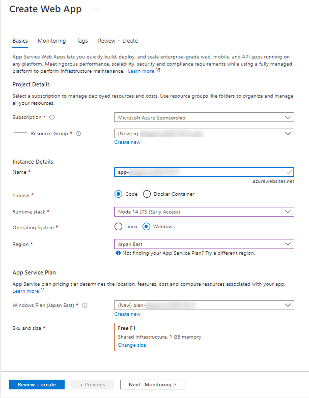
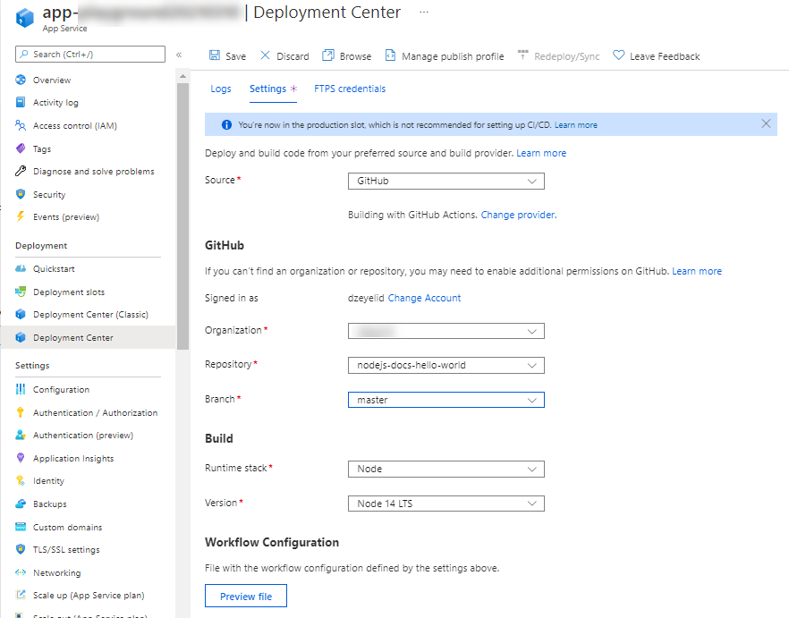
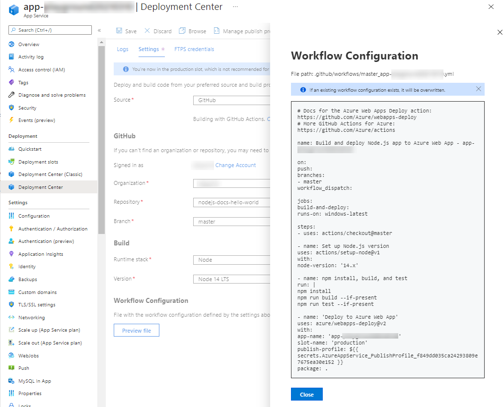
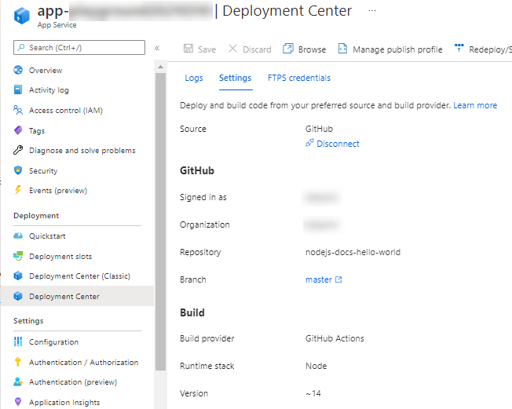
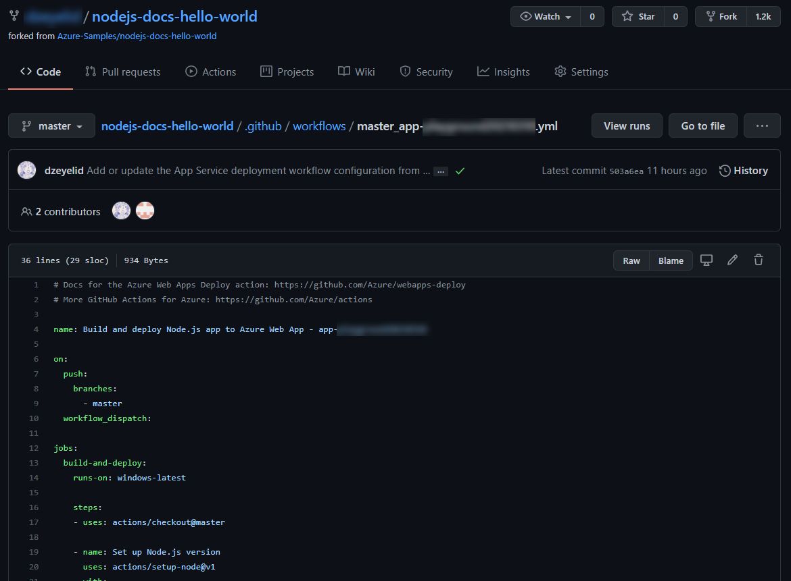
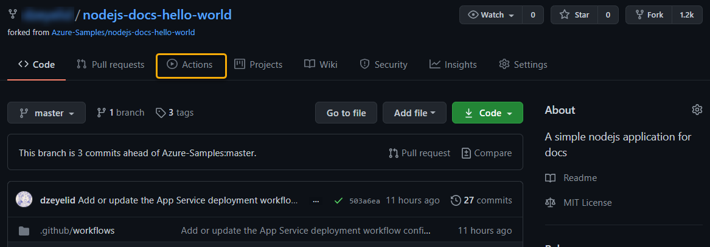
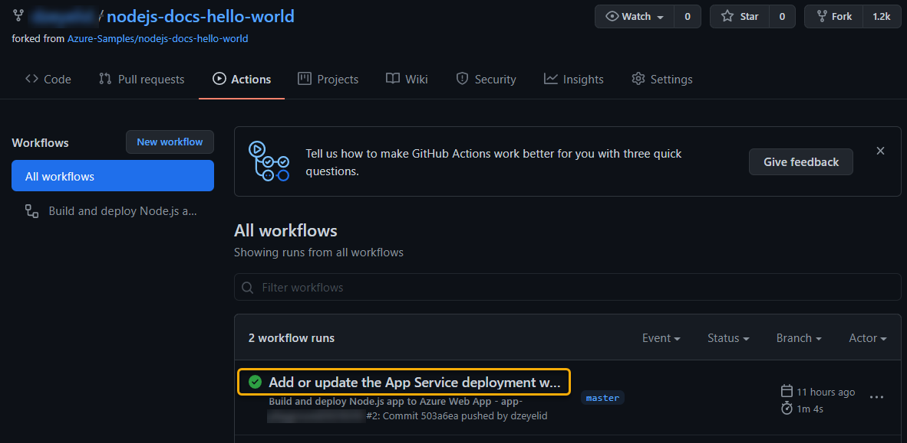
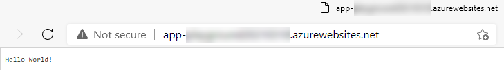

# Node.js 製ウェブアプリを Microsoft Azure の Web App へデプロイする

GitHub Actions を利用し、ウェブアプリを Azure Web App へデプロイします。

Azure Web App は様々な言語に対応した PaaS サービスです。詳細は下記ドキュメントなどをご参照ください。

- [概要 - Azure App Service | Microsoft Docs](https://docs.microsoft.com/ja-jp/azure/app-service/overview)

ここでは、下記のドキュメントを参考に学習を進めます。

- [継続的なデプロイを構成する - Azure App Service | Microsoft Docs](https://docs.microsoft.com/ja-jp/azure/app-service/deploy-continuous-deployment?tabs=github)

備考: Microsoft Learn の関連コンテンツ

なお、Microsoft Learn にも Azure Web App へデプロイするシナリオのモジュール [GitHub Actions を使ったアプリケーションのビルドと Azure へのデプロイ](https://docs.microsoft.com/ja-jp/learn/modules/github-actions-cd/) があります。こちらは、Docker コンテナのイメージを作成し、Azure Web App for Containers へデプロイする方法を学ぶことができます。ご興味ある方はご参考ください。

大まかな流れは下記のとおりです。

- [1. ウェブアプリのコードを用意する](#1-ウェブアプリのコードを用意する)
- [2. Azure Web App のリソースを作成する](#2-azure-web-app-のリソースを作成する)
- [3. Azure ポータルから Deployment Center を設定する](#3-azure-ポータルから-deployment-center-を設定する)
- [4. リソースを削除する](#4-リソースを削除する)

## 手順
### 1. ウェブアプリのコードを用意する

それではまず、デプロイに使用するウェブアプリとして、上記ドキュメントの「[リポジトリを準備する](https://docs.microsoft.com/ja-jp/azure/app-service/deploy-continuous-deployment?tabs=github#prepare-your-repository)」で言及されている条件を満たすコードを、自身の GitHub のリポジトリに用意します。

とくに利用したいコードがない場合は、こちら [Azure-Samples/nodejs-docs-hello-world](https://github.com/Azure-Samples/nodejs-docs-hello-world) をフォークしてください。（クイックスタート: [Azure で Node.js Web アプリを作成する
](https://docs.microsoft.com/ja-jp/azure/app-service/quickstart-nodejs?pivots=platform-windows) で利用されているコードです。）

### 2. Azure Web App のリソースを作成する

つぎに、Azure Web App のリソースを作成しましょう。Runtime stack を前述で用意したコードに一致するよう選択し、その他の項目は適宜設定してリソースを作成してください。参考として、下記の設定で作成します。

| 項目 | 説明 |
|----|----|
| Resource Group | 「Create new」を選択し、`rg-` で始まる文字列で作成 |
| Name | `app-` で始まる文字列で作成 |
| Publish | 「Code」を選択 |
| Runtime stack | 「Node.js 14 LTS」を選択 |
| Operationg System | 「Windows」を選択 |
| Region | 最寄りのリージョン（「Japan East」など）を選択 |
| App Service Plan | 「Create new」を選択し、 `plan-` で始まる文字列で作成 |
| Sku and size | 「Free F1」 |
| Monitoring タブ | 今回は設定不要 |
| Tags タブ | 今回は設定不要 |

 

リソース名は、この推奨される省略形を利用すると、識別しやすくなります。

- [Azure リソースの種類に推奨される省略形 - Cloud Adoption Framework | Microsoft Docs](https://docs.microsoft.com/ja-jp/azure/cloud-adoption-framework/ready/azure-best-practices/resource-abbreviations)

リソースの作成が完了したら、作成直後のウェブアプリの様子を確認しておきましょう。「Go to resource」ボタンから作成したリソースの画面に遷移し、「Overview」で「URL」を参照します。

### 3. Azure ポータルから Deployment Center を設定する

それでは、早速 Deployment Center から GitHub Actions を設定しましょう！

左のメニューから「Deployment Center」を選択肢画面に遷移します。「Seettings」タブを開き、各項目を設定します。

| 設定項目 | 説明 |
|----|----|
| Source | 「GitHub」を選択 |
| GitHub > Authorize （または Signed in as） | 利用する GitHub アカウントでサインインし接続。サインイン済みでアカウントを変えたい場合は「Change Account」から変更 |
| GitHub > Organization | GitHub アカウントと同名の文字列、または利用したい組織を選択 |
| GitHub > Repository | 利用するリポジトリを選択（前述のクイックスタートのコードを利用される方は「nodejs-docs-hello-world」を選択） |
| GitHub > Branch | 利用するブランチを選択（前述のクイックスタートのコードを利用される方は「master」を選択） |
| Build > Runtime stack | 利用するランタイムスタックを選択（前述のクイックスタートのコードを利用される方は「Node」を選択） |
| Build > Version | 利用する言語のバージョンを選択（前述のクイックスタートのコードを利用される方は「Node 14 LTS」を選択） |

 

ここまで入力し、「Preview file」を選択すると、生成されるワークフローのコードを確認することができます。

 

問題なければ、画面上部の「Save」を選択し保存します。

 

設定した GitHub リポジトリを開き、作成されたワークフローファイルやアクションの実行状況を見てみましょう。

`.github/workflows` ディレクトリに新しくワークフローファイルが作成され、先ほど Azure ポータルの「Preview file」で表示したコードが反映されていることがわかります。

 

 

つぎに、アクションの実行状況を見てみると、先ほど作成した Web App にデプロイされていることがわかります。

 

 

 

Web App の URL を開くと、紐づけた GitHub リポジトリのコードが反映されていることがわかります。

 

#### `Azure/webapps-deploy` アクションについて

自動生成されたワークフローファイルでは、 [Azure/webapps-deploy](https://github.com/Azure/webapps-deploy) アクションを利用して Azure Web App にデプロイしています。

Azure Web App にデプロイするには認証が必要で、このアクションでは、２通りのやり方が提供されています。詳しくはドキュメントをご参照ください。

| 認証方法 | 説明 |
|----|----|
| パブリッシュプロファイルを利用する | Azureポータルなどを使用し「デプロイ資格情報」を取得し、`Azure/webapps-deploy` のプロパティ `publish-profile` に指定（指定するときは GitHub Actions のシークレット機能を利用） |
| `Azure/login` アクションを利用する | サービスプリンシパルを用いて [Azure/login](https://github.com/Azure/login) アクションと組合せて認証 |

なお、ワークフローを実行する環境のセットアップついては、各言語に合わせたガイドがあるのでご参照ください。

- [ガイド - GitHub Docs](https://docs.github.com/ja/actions/guides)

また、Azure Function へのデプロイには、[Azure/functions-action](https://github.com/Azure/functions-action) を利用できます。詳しくは下記をご参照ください。

- [GitHub Actions を使用した Azure Functions のコードの更新 | Microsoft Docs](https://docs.microsoft.com/ja-jp/azure/azure-functions/functions-how-to-github-actions?tabs=dotnet)

### 4. リソースを削除する

Azure で作成したリソースは、リソースグループごと削除することがおすすめです。リソースグループの画面を開き、画面上部の「Delete resource group」から削除します。

GitHub リポジトリは、「Settings」タブを開き、画面下部の「Delete this repository」を選択してください。一度削除すると復元できないので、よく確認の上操作を行ってください。
